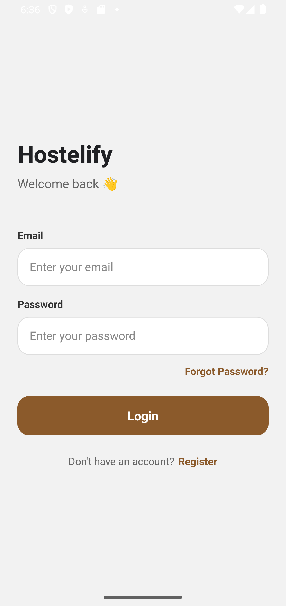
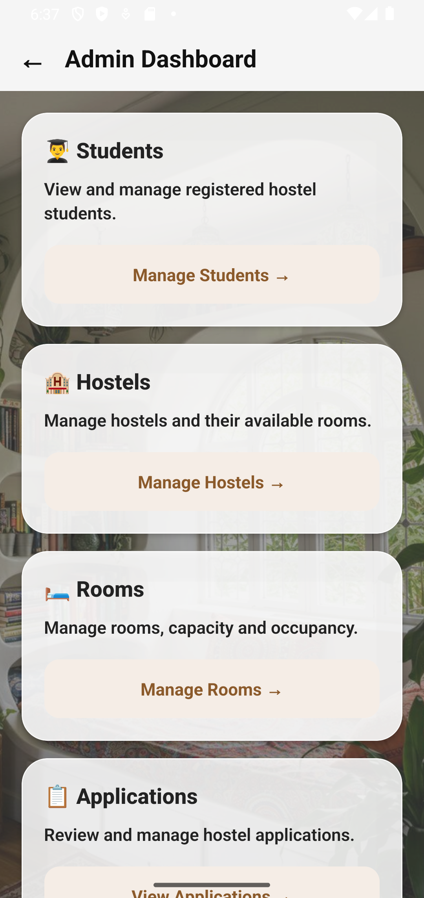
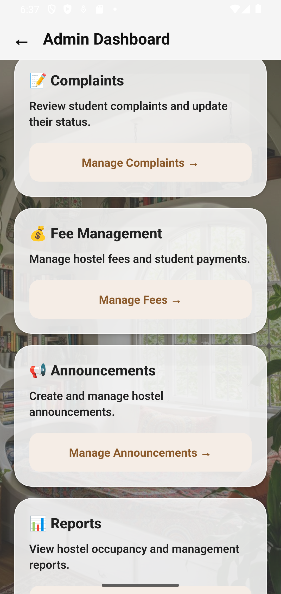
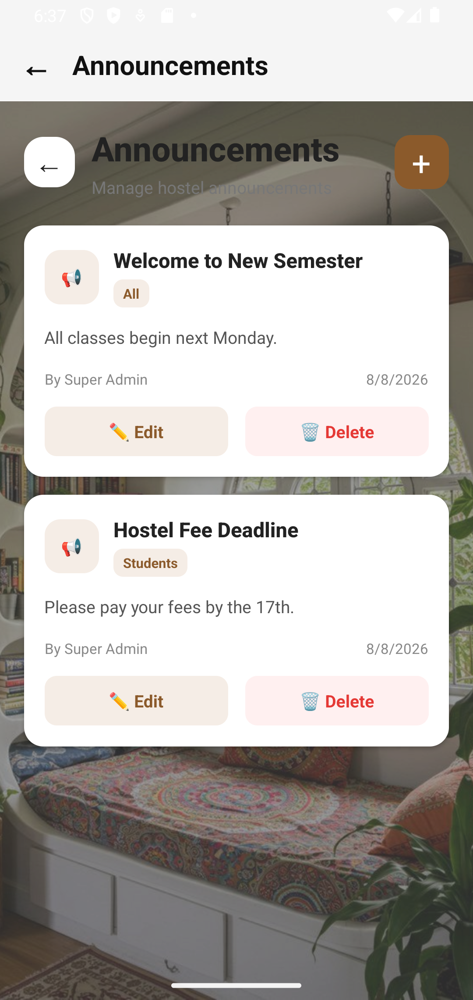
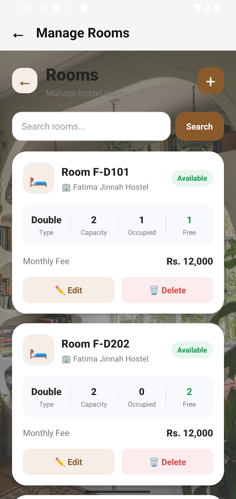
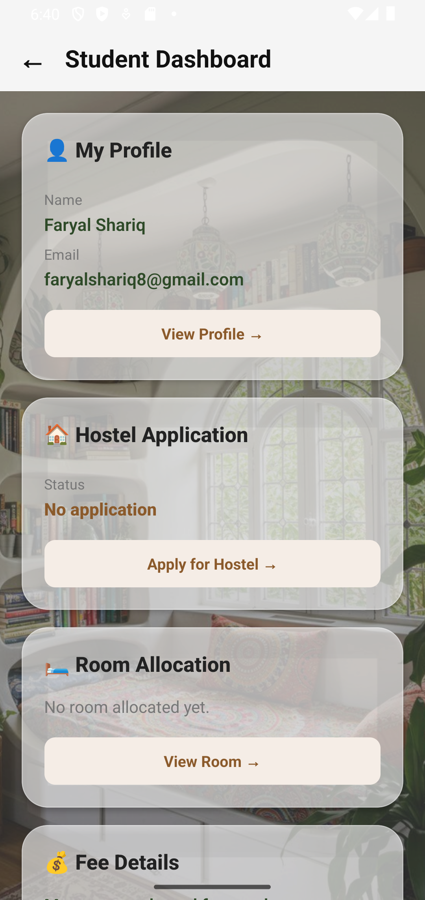
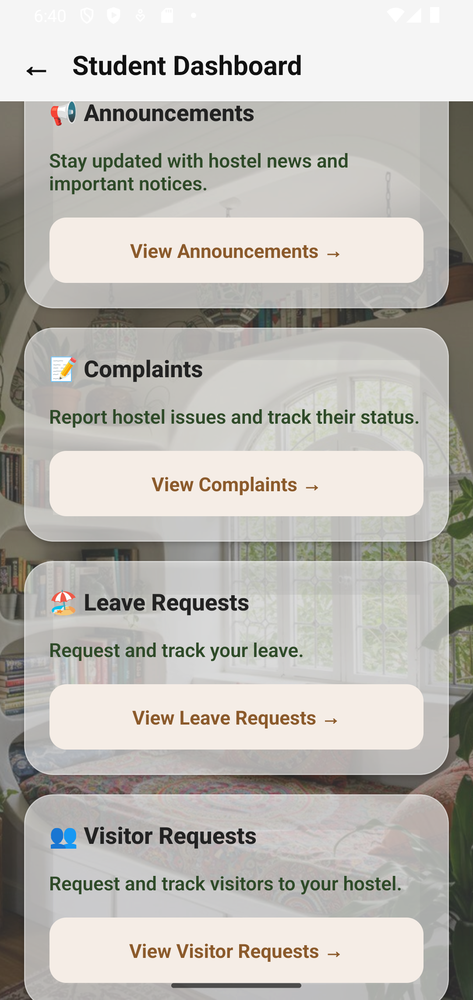
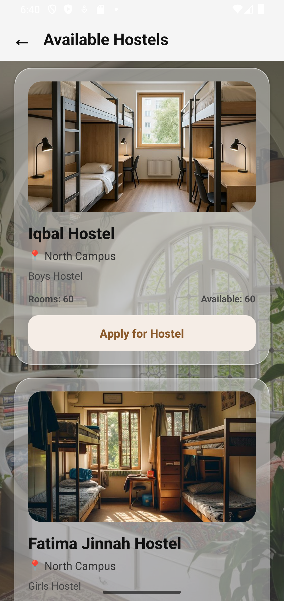
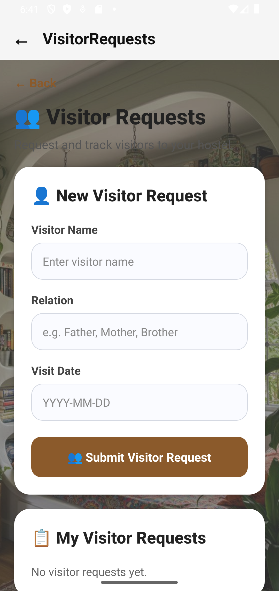

Hostelify — Hostel Management Mobile Application

A full-stack Hostel Management Mobile Application built with React Native and Expo, with a Node.js/Express REST API and MongoDB Atlas backend.

Hostelify provides separate experiences for students and administrators, covering hostel applications, room allocation, complaints, fees, announcements, leave requests, visitors, room transfers, profiles, authentication, and administrative reporting.

The application is designed to provide a centralized digital platform for managing hostel operations while giving students a simple way to manage their accommodation-related activities.

📱 Screenshots
Authentication

  

Login Screen

Admin Dashboard

   

Admin Dashboard Overview

The administrator dashboard provides access to the major hostel management modules including students, hostels, rooms, applications, complaints, fees, announcements, and reports.

Announcements

  

Announcements Management

Administrators can create, edit, delete, and manage announcements for hostel residents.

Room Management

  

Room Management

Administrators can manage hostel rooms, capacities, room types, occupancy, availability, and allocations.

Student Dashboard

   

Student Dashboard Overview

Students can access their profile, hostel application, room allocation, fees, announcements, complaints, leave requests, visitor requests, and room transfer features.

Available Hostels & Applications

  

Available Hostels

Students can browse available hostels and submit hostel applications.

Visitor Requests

  

Visitor Requests

Students can submit and track requests for hostel visitors.

✨ Features
🔐 Authentication & Security
Student and administrator login
JWT-based authentication
Protected API routes
Role-based authorization
Admin-only functionality
Persistent authentication sessions
Automatic session validation
Logout functionality
Forgot password flow
Password reset using reset tokens
Secure password hashing with bcrypt
👨‍🎓 Student Features
Student Dashboard

Students have a centralized dashboard containing:

Profile information
Hostel application status
Current room allocation
Hostel fee information
Announcements
Complaints
Leave requests
Visitor requests
Room transfer requests
Profile

Students can view their:

Full name
Email
Role
Hostel-related information
Account information
Hostel Applications

Students can:

Browse available hostels
View hostel details
Check hostel availability
Submit hostel applications
View application status
Room Allocation

Students can view:

Allocated room
Room number
Hostel
Room type
Occupancy information
Fees & Payments

Students can:

View their hostel fee information
View payment history
Submit simulated payments
Access payment-related information

The backend also includes Stripe payment-intent functionality for payment processing integration.

Complaints

Students can:

Submit complaints
Provide complaint descriptions
View submitted complaints
Track complaint status
Announcements

Students can view announcements relevant to hostel residents.

Leave Requests

Students can:

Submit leave requests
Specify start and end dates
Provide a reason
Track request status
Visitor Requests

Students can:

Submit visitor requests
Provide visitor information
Specify visit dates
Specify purpose and relationship
Track visitor request status
Room Transfer

Students can:

Request a room transfer
Select an available room
Track transfer requests
👨‍💼 Administrator Features
Admin Dashboard

Administrators can access:

Student management
Hostel management
Room management
Hostel applications
Complaints
Fee management
Announcements
Reports
Student Management

Administrators can:

View registered students
Search/filter students
Manage student information
Hostel Management

Administrators can:

Create hostels
Update hostels
Delete hostels
View hostel details
Track total rooms
Track available rooms
Room Management

Administrators can:

Create rooms
Update rooms
Delete rooms
Configure room capacity
Set room types
Track occupancy
Track availability

The system automatically prevents invalid occupancy states and keeps room availability synchronized.

Hostel Applications

Administrators can:

View student applications
Review applications
Approve applications
Allocate rooms to students
Automatic Room Allocation Updates

When an application is approved:

The student's allocation is created.
Room occupancy is updated.
Hostel room availability is updated.
Rooms become unavailable when capacity is reached.
Complaint Management

Administrators can:

View complaints
Search complaints
Update complaint status
Resolve complaints
Fee Management

Administrators can configure hostel fee structures based on:

Hostel
Room type
Fee amount
Payment Management

The backend supports:

Payment intents
Payment records
Payment history
Student payment information
Announcement Management

Administrators can:

Create announcements
Edit announcements
Delete announcements
Define target audiences
Reports Dashboard

Administrative reports include:

Dashboard statistics
Revenue information
Hostel occupancy
Complaint statistics
Application statistics
📋 Complete Screen List
Authentication Screens
Login
Forgot Password
Reset Password
Student Screens
Student Dashboard
Student Profile
Available Hostels
Hostel Application
Room Allocation
Fee Details
Announcements
Complaints
Leave Requests
Visitor Requests
Room Transfer
Admin Screens
Admin Dashboard
Manage Students
Manage Hostels
Manage Rooms
Manage Applications
Manage Complaints
Manage Fees
Manage Announcements
Reports Dashboard
🏗️ System Architecture
                    ┌──────────────────────┐
                    │   React Native App   │
                    │       + Expo         │
                    └──────────┬───────────┘
                               │
                               │ REST API / JWT
                               ▼
                    ┌──────────────────────┐
                    │   Node.js + Express  │
                    │      Backend API     │
                    └──────────┬───────────┘
                               │
                 ┌─────────────┴─────────────┐
                 │                           │
                 ▼                           ▼
        ┌─────────────────┐        ┌─────────────────┐
        │  MongoDB Atlas  │        │ Stripe / Other  │
        │    Database     │        │    Services     │
        └─────────────────┘        └─────────────────┘
🛠️ Technology Stack
Frontend
React Native
Expo
JavaScript
React Navigation
Axios
AsyncStorage
Expo Blur
Expo Splash Screen
Backend
Node.js
Express.js
MongoDB
Mongoose
JWT
bcrypt / bcryptjs
Stripe
REST API
Database
MongoDB Atlas
MongoDB Compass
Cloud & Deployment
Railway — Backend hosting
Cloudinary — Image hosting
GitHub — Source code management
Development & Testing
Android Studio
Android Emulator
Postman
Git
GitHub
🗄️ Database Models

Hostelify uses separate MongoDB collections for its major entities.

User

Stores:

Student/admin accounts
Name
Email
Password
Role
Hostel

Stores:

Hostel name
Location
Description
Total rooms
Available rooms
Hostel image URL
Room

Stores:

Hostel
Room number
Room type
Capacity
Occupancy
Fee
Availability
HostelApplication

Stores student hostel applications and their statuses.

RoomAllocation

Stores approved room allocations.

Complaint

Stores student complaints and their statuses.

FeeStructure

Stores hostel/room-type fee configurations.

FeePayment

Stores student payment records.

Announcement

Stores hostel announcements and their target audiences.

LeaveRequest

Stores student leave requests.

VisitorRequest

Stores student visitor requests.

RoomTransferRequest

Stores room transfer requests and approval information.

🔌 API Modules

The backend exposes REST endpoints for:

/api/auth
/api/profile
/api/dashboard
/api/hostels
/api/rooms
/api/applications
/api/complaints
/api/fees
/api/payments
/api/announcements
/api/leaves
/api/visitors
/api/reports

Authentication uses JWT tokens which are attached to protected requests.

🔑 Authentication Flow
User Login
     │
     ▼
POST /api/auth/login
     │
     ▼
Backend validates credentials
     │
     ▼
JWT generated
     │
     ▼
Token stored in AsyncStorage
     │
     ▼
API requests include:
Authorization: Bearer <token>
     │
     ▼
Protected backend route

The application also validates the saved session when the app starts.

☁️ Deployment

The backend is deployed using Railway.

Production API:

https://hostelify-production.up.railway.app

The mobile application communicates with the deployed backend instead of relying on the local development server.

This allows the application to work across multiple physical devices as long as they have internet access.

🖼️ Image Hosting

Hostel images are hosted using Cloudinary.

The application stores Cloudinary image URLs in MongoDB rather than storing image files directly in the database.

Example:

https://res.cloudinary.com/.../image/upload/.../hostel-image.jpg
🚀 Running the Project Locally
1. Clone the repository
git clone https://github.com/faryalshariq8/hostelify.git
cd hostelify
2. Install backend dependencies
cd backend
npm install

Create a .env file containing the required backend configuration.

Example:

MONGO_URI=your_mongodb_connection_string
JWT_SECRET=your_jwt_secret
STRIPE_SECRET_KEY=your_stripe_secret_key
RESEND_API_KEY=your_resend_api_key

Never commit your .env file to GitHub.

3. Start the backend
npm run dev

The local backend runs on:

http://localhost:5000
4. Install frontend dependencies

Open another terminal:

cd frontend
npm install
5. Run the Android development build

Make sure an Android emulator is running, then:

npx expo run:android
📦 Building the Android APK

To generate a release APK:

npx expo run:android --variant release

The generated APK can be found at:

frontend/android/app/build/outputs/apk/release/app-release.apk

The APK can then be transferred to an Android phone and installed for testing.

🧪 API Testing

The project includes API testing resources for testing:

Authentication
Hostel management
Rooms
Applications
Allocations
Fees
Payments
Complaints
Announcements
Leave requests
Visitor requests
Room transfers
Reports

Postman can be used to test the REST API endpoints.

🔒 Security

Sensitive configuration is intentionally excluded from source control.

The following should never be committed:

.env
API keys
JWT secrets
Stripe secret keys
Resend API keys
Database credentials

GitHub Push Protection is used to prevent accidental secret exposure.

🎨 UI & Design

Hostelify uses a modern, soft visual design with:

Brown and cream color palette
Glassmorphism-inspired cards
Rounded UI components
Blur effects
Consistent typography
Responsive mobile layouts
Separate admin and student experiences

The interface was designed to maintain a consistent visual language across the application's major screens.

📂 Project Structure
hostelify/
│
├── backend/
│   ├── config/
│   ├── controllers/
│   ├── middleware/
│   ├── models/
│   ├── routes/
│   ├── seed.js
│   ├── server.js
│   └── package.json
│
├── frontend/
│   ├── assets/
│   ├── src/
│   │   ├── api/
│   │   ├── components/
│   │   ├── context/
│   │   ├── navigation/
│   │   ├── screens/
│   │   │   ├── admin/
│   │   │   └── student/
│   │   └── services/
│   ├── app.json
│   └── package.json
│
├── screenshots/
│   ├── login.png
│   ├── admin-dashboard-1.png
│   ├── admin-dashboard-2.png
│   ├── announcements.png
│   ├── manage-rooms.png
│   ├── student-dashboard-1.png
│   ├── student-dashboard-2.png
│   ├── available-hostels.png
│   └── visitor-requests.png
│
└── README.md
👩‍💻 Author

Faryal Shariq

Full-Stack Mobile Application Project

Built using React Native, Node.js, Express.js, MongoDB Atlas, Railway, and Cloudinary.

📄 License

This project was developed as an academic/software development project.

⭐ Project Highlights

Hostelify demonstrates full-stack application development through:

Mobile application development
REST API development
JWT authentication
Role-based authorization
MongoDB database design
CRUD operations
Room allocation logic
Hostel availability management
Payment integration
Cloud image hosting
Persistent mobile sessions
API testing
Cloud deployment
Android APK generation
Git/GitHub version control